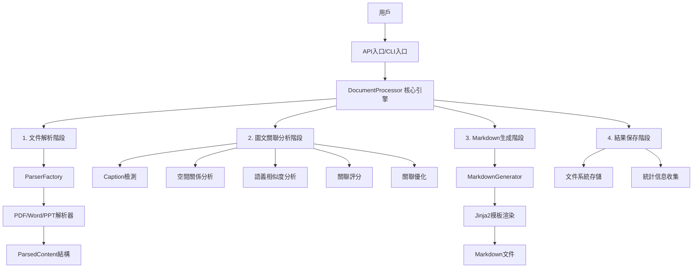
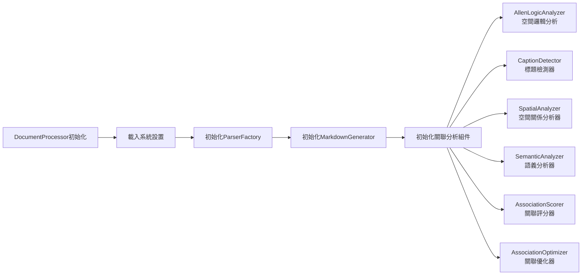
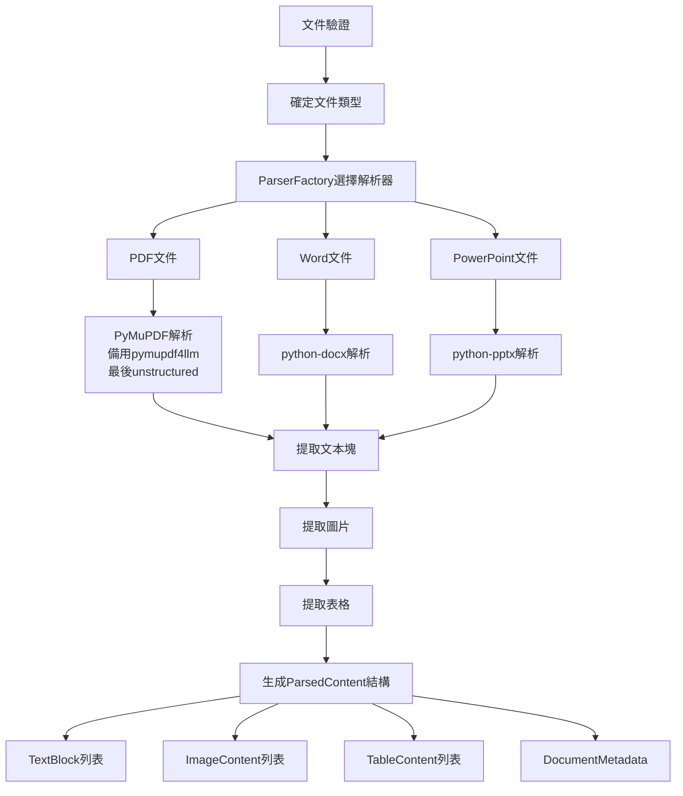
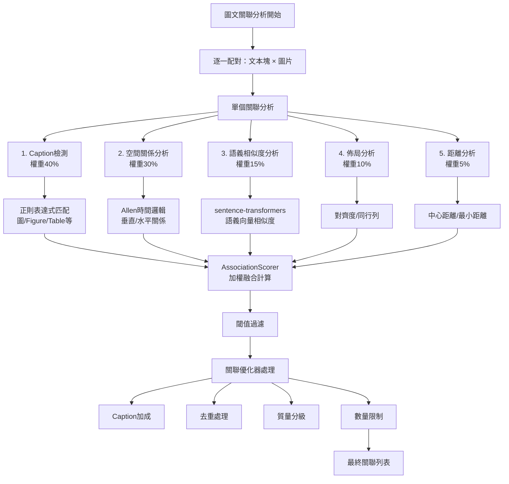
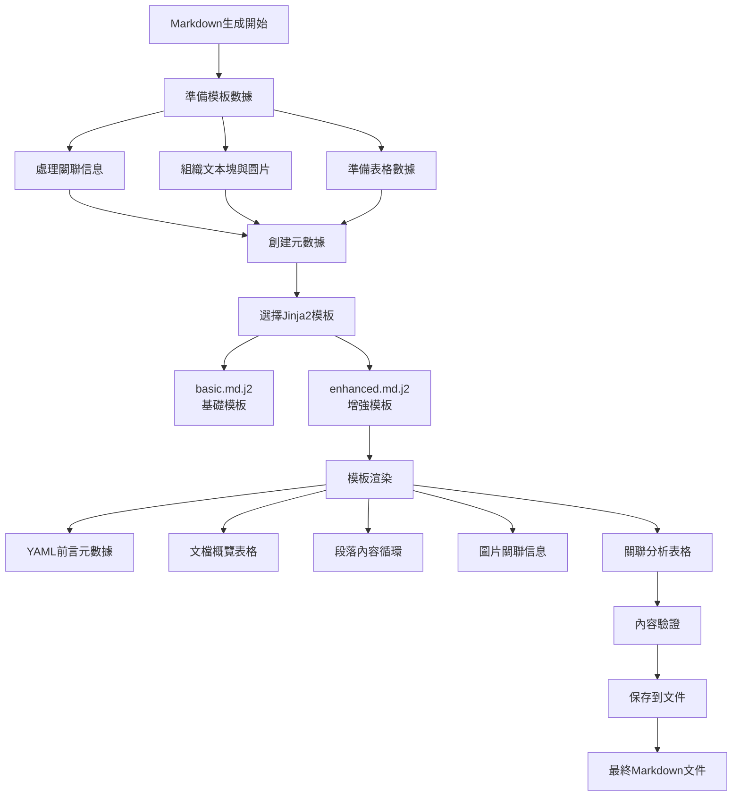
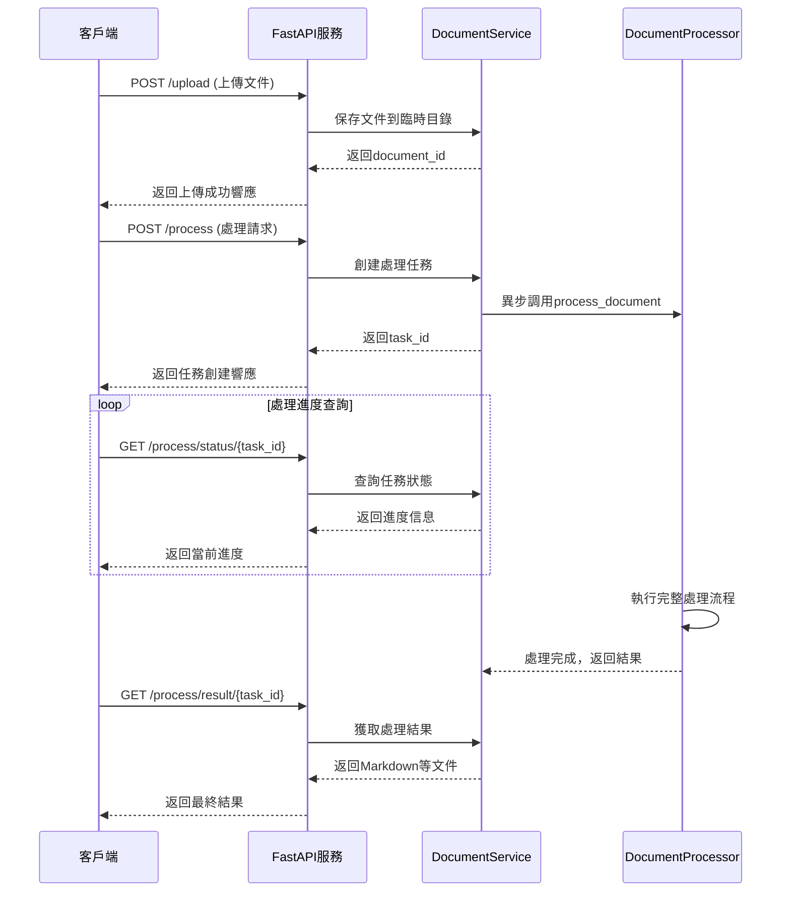

# 智能文件轉換與RAG系統 - 完整運行流程圖表

## 📊 系統架構總覽



## 🔄 詳細處理流程

### **階段一：系統初始化**



**核心組件說明:**
- **settings**: 系統配置管理 (Pydantic)
- **parser_factory**: 文件解析器工廠 (支援PDF/Word/PPT)
- **markdown_generator**: Markdown輸出生成器 (Jinja2模板)
- **allen_analyzer**: Allen時間邏輯分析器 (13種空間關係)
- **caption_detector**: Caption檢測器 (40%權重，正則匹配)
- **spatial_analyzer**: 空間關係分析器 (30%權重，增強算法)
- **semantic_analyzer**: 語義分析器 (15%權重，sentence-transformers)
- **association_scorer**: 關聯評分器 (加權融合計算)
- **association_optimizer**: 關聯優化器 (去重、過濾、質量提升)

### **階段二：文件解析**



**解析策略:**
- **PDF解析**: 優先使用PyMuPDF → pymupdf4llm → unstructured (多層備用機制)
- **Word解析**: python-docx (直接解析)
- **PPT解析**: python-pptx (幻燈片解析)
- **輸出結構**: ParsedContent包含所有提取的文本塊、圖片、表格和元數據

### **階段三：圖文關聯分析（核心）**



**權重分配 (嚴格按照項目規則):**
- Caption檢測: **40%** (最高優先級)
- 空間關係: **30%** (次高優先級)
- 語義相似度: **15%**
- 佈局模式: **10%**
- 距離計算: **5%**

**關聯分析詳細步驟:**
1. **Caption檢測**: 使用正則表達式匹配「圖1」、「Figure 1」、「如圖所示」等模式
2. **空間關係**: 基於Allen邏輯的13種空間關係，包含垂直優先算法
3. **語義分析**: sentence-transformers計算文本與圖片描述的向量相似度
4. **評分融合**: AssociationScorer按權重進行加權平均
5. **關聯優化**: Caption加成、去重、質量分級、數量限制

### **階段四：Markdown生成**



**模板結構:**
- **YAML前言**: 文檔元數據 (document_id, 處理時間, 統計信息)
- **文檔概覽**: 基本信息表格
- **段落內容**: 循環渲染每個文本塊
- **圖片關聯**: 在相關段落下方顯示關聯的圖片
- **關聯分析**: 底部顯示完整的關聯分析表格

## 📱 API接口流程（可選）



## 📋 完整流程總結

### **入口點選擇**
- **CLI模式**: `python -m src.main input.pdf -o output/`
- **API模式**: FastAPI服務 + 異步處理

### **核心處理階段**
1. **初始化** (DocumentProcessor.__init__)
2. **文件解析** (ParserFactory + 具體Parser)
3. **關聯分析** (5種分析器 + 評分融合 + 優化)
4. **生成輸出** (MarkdownGenerator + Jinja2模板)
5. **結果保存** (文件系統存儲)

### **關鍵組件調用鏈**
```
DocumentProcessor → ParserFactory → [PDF/Word/PPT]Parser → 
ParsedContent → AssociationAnalysis → [Caption/Spatial/Semantic/Layout/Proximity]Analyzers → 
AssociationScorer → AssociationOptimizer → MarkdownGenerator → 
Jinja2Templates → FinalOutput
```

### **核心文件結構**
```
src/
├── main.py                    # 主入口點，DocumentProcessor
├── parsers/                   # 文件解析器
│   ├── parser_factory.py     # 解析器工廠
│   ├── pdf_parser.py         # PDF解析 (PyMuPDF)
│   ├── word_parser.py        # Word解析 (python-docx)
│   └── ppt_parser.py         # PPT解析 (python-pptx)
├── association/               # 圖文關聯分析
│   ├── caption_detector.py   # Caption檢測 (40%權重)
│   ├── spatial_analyzer.py   # 空間關係分析 (30%權重)
│   ├── semantic_analyzer.py  # 語義分析 (15%權重)
│   ├── association_scorer.py # 評分融合計算
│   ├── association_optimizer.py # 關聯優化
│   ├── candidate_ranker.py   # 候選排序器
│   └── allen_logic.py        # Allen邏輯分析
├── markdown/                  # Markdown生成
│   ├── generator.py          # 主生成器
│   ├── formatter.py          # 格式化工具
│   └── templates/            # Jinja2模板
└── api/                      # FastAPI接口
    ├── app.py               # 應用入口
    └── routes/              # 路由定義
```

## 🚨 當前發現的問題點

基於對workflows_sample_complete.md的分析，發現以下關鍵問題：

### **1. 佈局檢測被禁用**
**位置**: `src/main.py:221`
```python
'layout_type': 'single_column',  # 硬編碼禁用動態檢測
```
**影響**: 無法正確識別多欄佈局，空間距離歸一化失效

### **2. 關聯策略原始**  
**位置**: `src/main.py:162-163`
```python
for text_block in parsed_content.text_blocks:
    for image in parsed_content.images:  # 簡單逐一配對
```
**影響**: 未使用CandidateRanker的最近上方優先策略

### **3. 類型判定過早**
**位置**: `src/main.py:281`
```python
"association_type": "caption" if caption_score > 0.5 else "spatial",
```
**影響**: 在優化前決定類型，導致Caption檢測✅但類型顯示spatial的不一致

### **4. 段落102問題根源**
**現象**: "下列圖表描述了工作對商務名片進行拼版的方式" 未被優先關聯到其下方圖片
**根因**: 
- 缺乏最近上方優先規則
- 空間距離計算被固定佈局設置削弱
- Caption指示詞檢測到但權重計算後仍被空間近距離候選超越

## 🔧 修正建議

1. **啟用動態佈局檢測**: 移除硬編碼的single_column設置
2. **整合CandidateRanker**: 使用智能候選排序替代簡單逐一配對
3. **同步關聯類型更新**: 在優化階段同步更新association_type
4. **實施最近上方優先**: 對於Caption指示詞明確的文本，給予位置加權

---

*文檔生成時間: 2025年1月11日*  
*系統版本: 智能文件轉換與RAG知識庫系統 v1.0*
